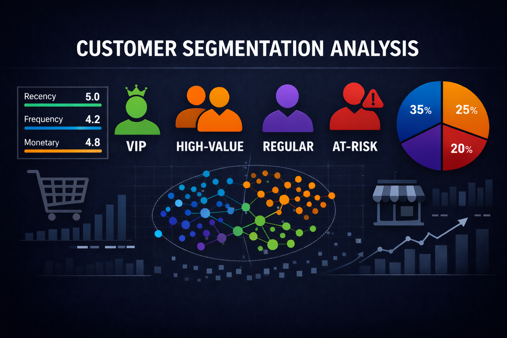
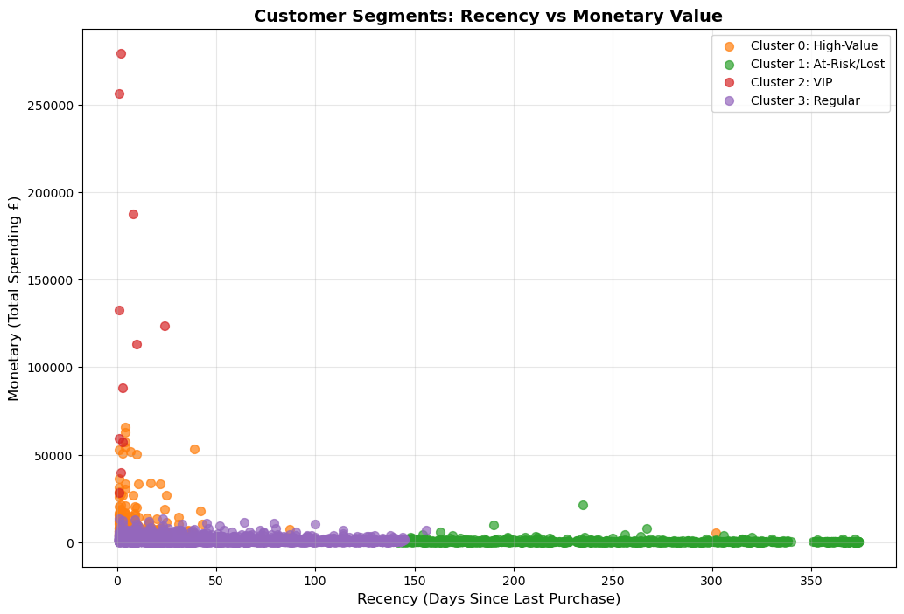
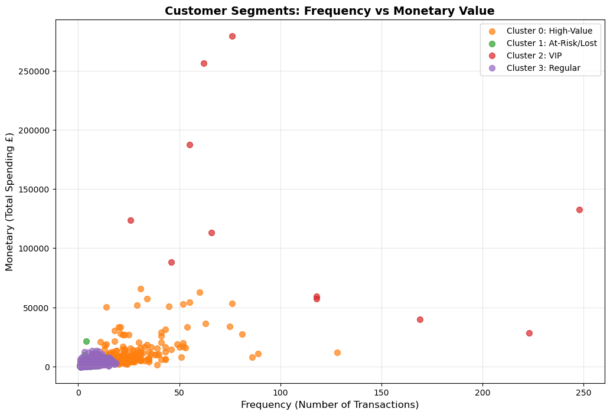
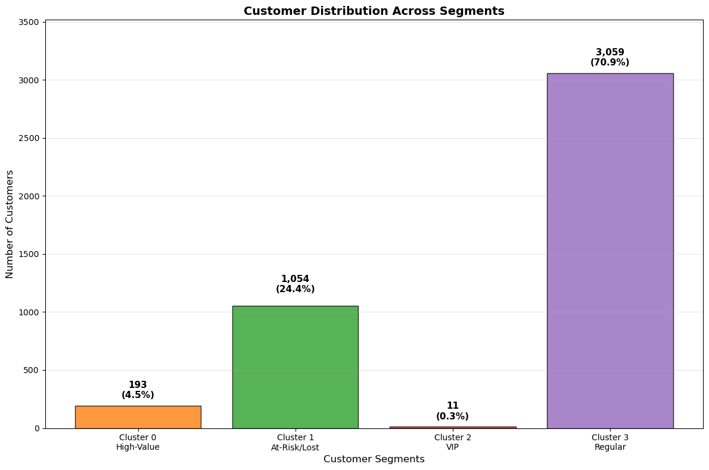

# Customer Segmentation Analysis - Online Retail




---

## Overview

This project performs customer segmentation analysis on online retail transaction data to identify distinct customer groups based on purchasing behavior using RFM (Recency, Frequency, Monetary) analysis combined with K-Means clustering. The analysis enables data-driven marketing strategies and customer retention programs by categorizing customers into actionable segments.

**Business Problem:** How can an online retailer identify and prioritize different customer segments to maximize revenue, improve retention, and optimize marketing spend?

---

## Key Features

- RFM (Recency, Frequency, Monetary) metric calculation for customer behavior analysis
- K-Means clustering with elbow method optimization to determine optimal segments
- Four distinct customer segments identified: VIP, High-Value, Regular, and At-Risk customers
- Comprehensive segment profiling with distribution, spending patterns, and purchase frequency
- Actionable business recommendations tailored to each customer segment
- Interactive visualizations including scatter plots, distribution charts, and segment profiles

---

## Dataset

| Property | Detail |
|----------|--------|
| Source | [Kaggle - Online Retail Customer Clustering](https://www.kaggle.com/datasets/hellbuoy/online-retail-customer-clustering) |
| Time Period | December 2010 - December 2011 |
| Size | 541,909 transactions |
| Customers | 4,312 unique customers (after cleaning) |
| Features | InvoiceNo, StockCode, Description, Quantity, InvoiceDate, UnitPrice, CustomerID, Country |
| Business Type | UK-based online retail specializing in unique all-occasion gifts |

---

## Tech Stack

- **Python 3.9+**
- **Pandas** — data manipulation and RFM calculation
- **NumPy** — numerical computations
- **Scikit-learn** — K-Means clustering and scaling
- **Matplotlib / Seaborn** — visualizations
- **Jupyter Notebook** — analysis environment

---

## Installation

```bash
# Clone the repository
git clone https://github.com/yourusername/customer-segmentation-analysis.git
cd customer-segmentation-analysis

# Create and activate virtual environment
python -m venv venv
source venv/bin/activate  # On Windows: venv\Scripts\activate

# Install dependencies
pip install -r requirements.txt
```

---

## Project Structure

```
customer-segmentation-analysis/
├── README.md
├── requirements.txt
├── dataset/
│   └── OnlineRetail_sample.csv
├── notebook/
│   └── customer_segmentation_analysis.ipynb
└── images/
    ├── banner.png
    ├── rfm_clusters.png
    ├── segment_distribution.png
    └── elbow_method.png
```

---

## How to Run

```bash
# Launch Jupyter Notebook
jupyter notebook notebook/customer_segmentation_analysis.ipynb
```

Run all cells sequentially. The notebook is structured as: data loading → cleaning → RFM calculation → clustering → segment analysis → business recommendations.

---

## Results

### Customer Segments Identified

| Segment | Count | % of Base | Avg Recency | Avg Frequency | Avg Monetary |
|---------|-------|-----------|-------------|---------------|--------------|
| **VIP Customers** | 11 | 0.3% | 5 days | 109.7 transactions | £124,150.43 |
| **High-Value** | 193 | 4.5% | 11 days | 28.6 transactions | £12,190.96 |
| **Regular** | 3,059 | 70.9% | 42 days | 4.4 transactions | £1,326.62 |
| **At-Risk/Lost** | 1,054 | 24.4% | 246 days | 1.9 transactions | £488.70 |

### Key Insights

- **VIP customers (0.3%) drive disproportionate revenue, generating £1,365,654.76 (16.5% of total revenue)
- **70.9% of customers are Regular buyers** with moderate engagement — significant growth opportunity through upselling
- **24.4% of customers are At-Risk** having not purchased in 8+ months — urgent reactivation needed
- **Clear upgrade path exists** from Regular → High-Value → VIP segments based on behavior patterns

### Visualizations

**1. RFM Cluster Analysis - Recency vs Monetary**
Four distinct customer segments emerge with VIP customers showing recent activity and massive spending, while At-Risk customers show high recency (long time since purchase) and lower spending.



**2. RFM Cluster Analysis - Frequency vs Monetary**
VIP customers demonstrate extreme purchase frequency (50-250+ transactions) combined with the highest spending, while Regular customers cluster at low frequency and moderate spending.



**3. Customer Distribution by Segment**
Regular customers dominate the customer base at 71%, while VIP and High-Value segments combined represent only 4.8% but generate nearly half of total revenue (44.9%).



### Business Interpretation

The analysis reveals a classic power-law distribution where a small percentage of customers (VIP + High-Value = 4.8%) generate nearly half of total revenue (44.9%). The large Regular customer base (71%) presents a significant growth opportunity through targeted engagement campaigns to increase purchase frequency and order value.

The 24% At-Risk customer segment represents both a challenge and opportunity — these customers have demonstrated purchase intent but require reactivation campaigns before they churn permanently.

---

## Business Recommendations

### VIP Customers (0.3% - Top Priority)
- Implement dedicated account management and white-glove service
- Provide exclusive early access to new products
- Offer premium loyalty rewards and personalized experiences
- Regular personal outreach to maintain relationships

### High-Value Customers (4.5% - Growth Focus)
- Create VIP upgrade pathway with targeted incentives
- Cross-sell premium products to increase order value
- Send personalized product recommendations based on purchase history
- Monitor for any decline in activity and intervene immediately

### Regular Customers (70.9% - Volume Opportunity)
- Launch email campaigns to increase purchase frequency
- Offer bundle deals and volume discounts
- Implement loyalty program with clear progression tiers
- A/B test promotions to identify most effective engagement tactics

### At-Risk/Lost Customers (24.4% - Win-Back Campaign)
- Deploy immediate win-back campaign with special offers
- Survey to understand reasons for inactivity
- Segment by past value and tailor reactivation approach
- Re-engagement incentives scaled to previous customer value

---

## Future Work

- Implement product affinity analysis to improve cross-selling strategies
- Add customer lifetime value (CLV) prediction model
- Conduct cohort analysis to track segment migration over time
- Build predictive churn model to identify at-risk customers earlier
- Integrate real-time segmentation for dynamic marketing automation
- Expand analysis to include geographic and seasonal patterns
